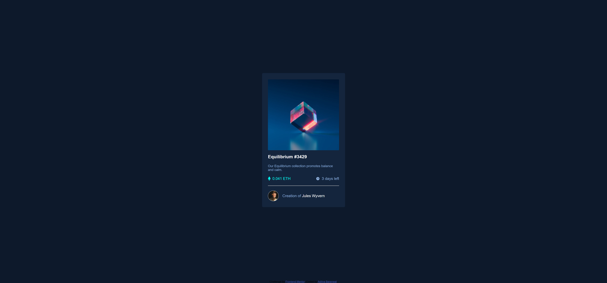

# Frontend Mentor - NFT preview card component solution

This is a solution to the [NFT preview card component challenge on Frontend Mentor](https://www.frontendmentor.io/challenges/nft-preview-card-component-SbdUL_w0U). Frontend Mentor challenges help you improve your coding skills by building realistic projects. 

## Table of contents

- [Overview](#overview)
  - [The challenge](#the-challenge)
  - [Screenshot](#screenshot)
  - [Links](#links)
- [My process](#my-process)
  - [Built with](#built-with)
  - [What I learned](#what-i-learned)
  - [Continued development](#continued-development)
  - [Useful resources](#useful-resources)
- [Author](#author)
- [Acknowledgments](#acknowledgments)

## Overview

### The challenge

Users should be able to:

- View the optimal layout depending on their device's screen size
- See hover states for interactive elements

### Screenshot

.png)

.png)

### Links

- Solution URL: [Get solution](https://github.com/CHARLIEADITYA/nft-preview-card-component-main.git)
- Live Site URL: [View](https://charlieaditya.github.io/nft-preview-card-component-main/)

## My process

### Built with

- Semantic HTML5 markup
- CSS custom properties
- Flexbox

### What I learned
In this task i learn how to hover effect of colour and image are set.

To see how you can add code snippets, see below:

```css
.image:hover::after {
    transition: opacity .3s ease-in-out;
    opacity: 0.7
}

.image:after {
    position: absolute;
    content: "";
    background: url("./images/icon-view.svg") no-repeat rgba(0, 255, 247, .45);
    background-position: center;
    background-size: auto;
    width: 100%;
    height: 100%;
    /* left: 50%; */
    /* top: 50%; */
    /* transform: translate(-50%, -50%); */
    cursor: pointer;
    opacity: 0
```


## Author

- Github - [CHARLIEADITYA](https://github.com/CHARLIEADITYA)
- Frontend Mentor - [@CHARLIEADITYA](https://www.frontendmentor.io/profile/CHARLIEADITYA)
- Linkedin - [@adityabaranwal34](https://www.linkedin.com/in/adityabaranwal34/)

